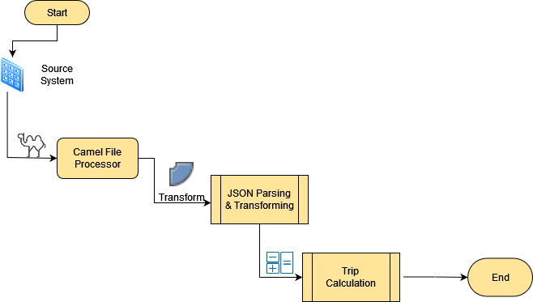

# 407etr Toll Calculator
The Toll Calculator is intended for estimating trip costs and distance only. 
It determine these by calculating latitude and longitude information from point one to another.

Design : 

Swagger : 

Usage :

